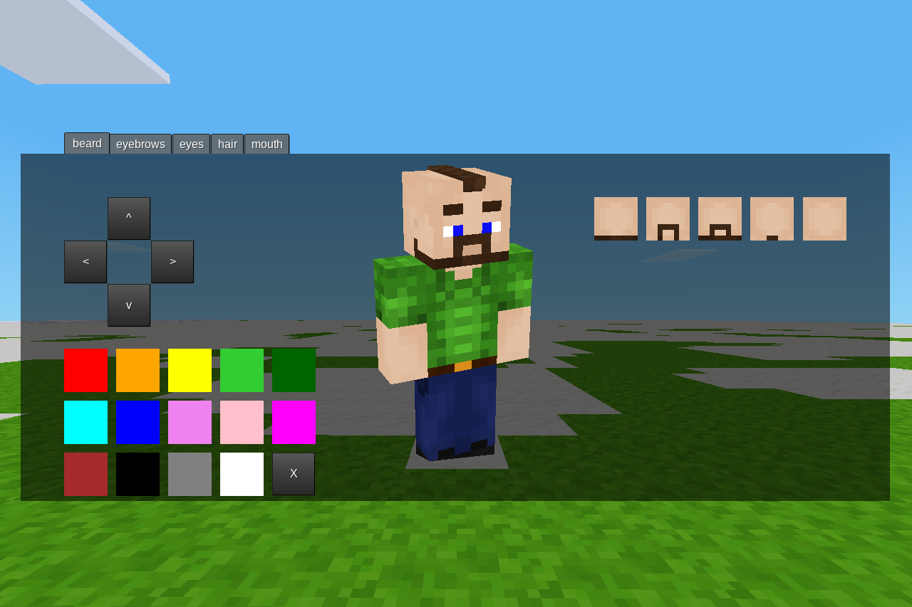

# Miise
Created as an exercise in formspecs and entity manipulation for a Discord challenge.  

Type `/miise`. Create a character. Just go wild.  

_Basically character\_creator 2.0!_  

The available features and current API are minimal and lack polish. Do not take this mod seriously yet.

### API
`miise.register_feature_type(name, definition)`: Register a feature type.
Feature type definition:
```lua
{
    label = "String", -- Currently unused
    symmetrical = false, -- Will mirror feature
    range = { -- Minumum and maximum position (inclusive)
        min = {x = 0, y = 0},
        max = {x = 7, y = 7},
    },
    default = {x = 2, y = 6}, -- Default position
}
```

`miise.register_feature(name, type, definition)`: Register a feature.
Feature definiton:
```lua
{
    texture = "path_to_texture.png",
    mask = "path_to_mask.png", -- Determines which part of the texture can be colored
}
```

Original Sam texture by Jordach ([CC BY-SA 3.0](https://creativecommons.org/licenses/by-sa/3.0/)).
